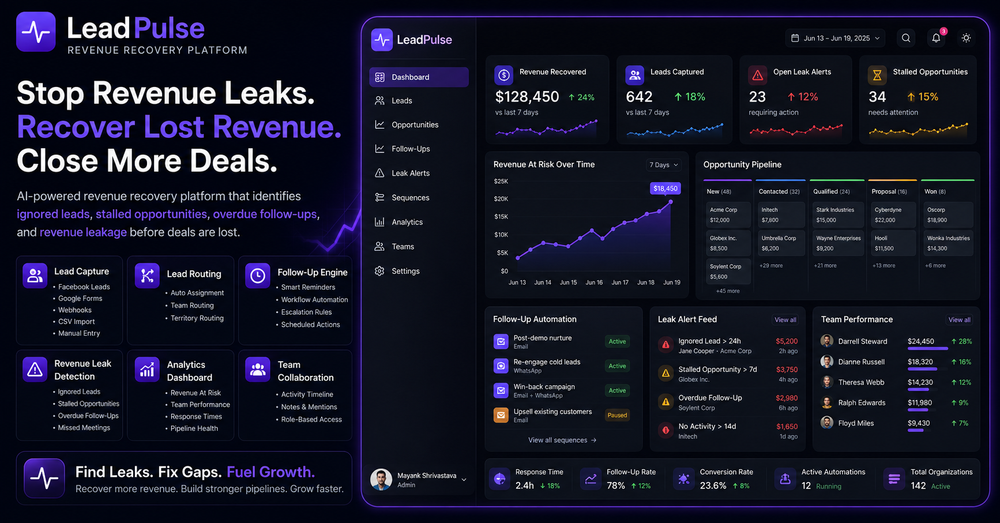
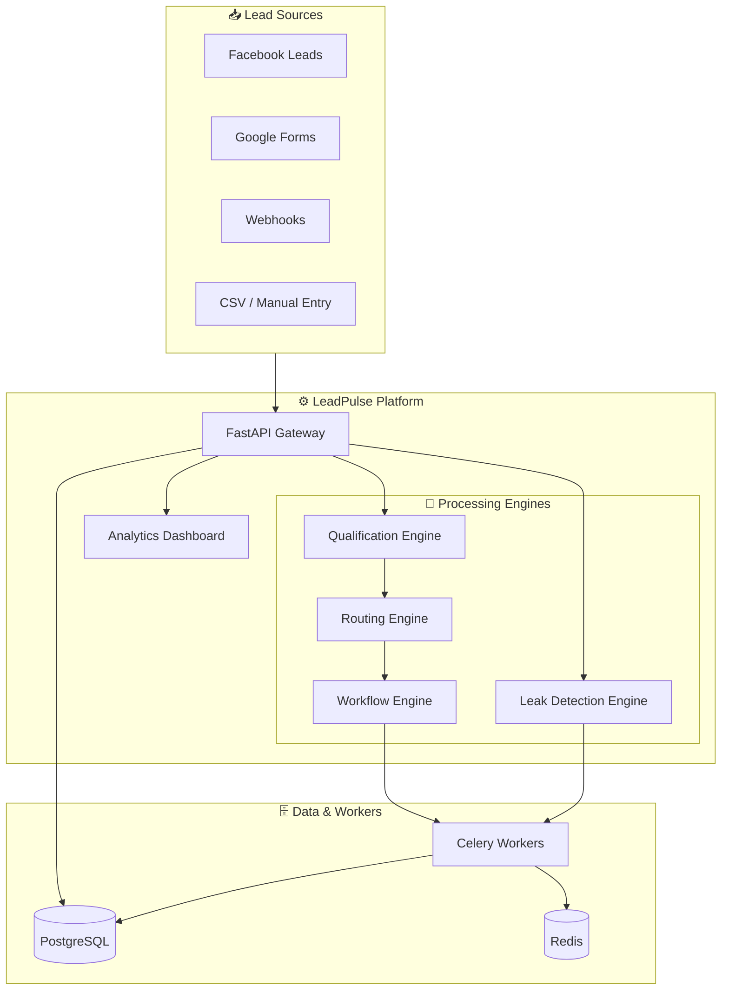

```markdown
<div align="center">
  

  # ⚡ LeadPulse
  ### AI-Powered Revenue Recovery Platform

  *Capture leads, automate follow-ups, detect revenue leaks, and recover lost revenue before opportunities disappear.*

  <br/>

  [](https://www.python.org/)
  [](https://fastapi.tiangolo.com/)
  [](https://reactjs.org/)
  [](https://www.typescriptlang.org/)
  [](https://www.postgresql.org/)
  [](https://www.docker.com/)
  [](https://opensource.org/licenses/MIT)

</div>

<br/>

---

## 📖 Overview

**LeadPulse** is an enterprise-grade revenue recovery platform designed for high-velocity sales teams. Modern pipelines bleed revenue not from bad products, but from missed follow-ups, ignored leads, and stalled opportunities. LeadPulse acts as an **autonomous safety net** — ingesting leads from multiple sources, routing them intelligently, identifying revenue leaks, and triggering smart recovery workflows.

---

## 🚨 Revenue Leaks Cost Real Money

LeadPulse continuously scans your pipeline to identify:

- Leads that have never been contacted
- Opportunities stuck in the same stage
- Missed meetings that require recovery
- Overdue follow-ups
- SLA violations
- Slow response times

Instead of discovering lost revenue after the deal is gone, teams get proactive alerts while recovery is still possible.

---

## ✨ Core Features

<table>
  <tr>
    <td width="50%">
      <h3>🎣 Lead Capture</h3>
      <p>Ingest leads from anywhere without custom integrations.</p>
      <ul>
        <li><strong>Integrations:</strong> Facebook Leads, Google Forms, Webhooks</li>
        <li><strong>Manual & Bulk:</strong> CSV Imports, Manual Entry</li>
      </ul>
    </td>
    <td width="50%">
      <h3>🛤️ Lead Routing</h3>
      <p>Right leads to the right reps, instantly.</p>
      <ul>
        <li><strong>Territory-Based:</strong> Geographic/firmographic routing</li>
        <li><strong>Team Routing:</strong> Round-robin, performance-based</li>
        <li><strong>Direct Assignment:</strong> Key account handoffs</li>
      </ul>
    </td>
  </tr>
  <tr>
    <td>
      <h3>🔄 Follow-Up Engine</h3>
      <p>Never let a prospect fall through the cracks.</p>
      <ul>
        <li><strong>Smart Reminders:</strong> Context-aware prompts</li>
        <li><strong>Workflow Automation:</strong> Multi-step sequences</li>
        <li><strong>Escalation Rules:</strong> Auto-escalate ignored leads</li>
        <li><strong>Scheduled Actions:</strong> Time-delayed outreach</li>
      </ul>
    </td>
    <td>
      <h3>🚨 Revenue Leak Detection</h3>
      <p>AI-driven bottleneck identification.</p>
      <ul>
        <li><strong>Ignored Leads:</strong> Zero-activity flags</li>
        <li><strong>Stalled Opportunities:</strong> Stage duration monitoring</li>
        <li><strong>Missed Meetings:</strong> No-show rescheduling</li>
        <li><strong>Overdue Follow-Ups:</strong> SLA breach alerts</li>
      </ul>
    </td>
  </tr>
  <tr>
    <td>
      <h3>📊 Analytics Dashboard</h3>
      <p>Total pipeline visibility.</p>
      <ul>
        <li><strong>Revenue At Risk:</strong> Dollar value of stalled deals</li>
        <li><strong>Pipeline Health:</strong> Real-time conversion metrics</li>
        <li><strong>Team Performance:</strong> Leaderboards & activity tracking</li>
        <li><strong>Response Times:</strong> Time-to-First-Touch (TTFT)</li>
      </ul>
    </td>
    <td>
      <h3>🤝 Team Collaboration</h3>
      <p>Built for multiplayer sales.</p>
      <ul>
        <li><strong>Activity Timeline:</strong> Centralized interaction log</li>
        <li><strong>Notes & Mentions:</strong> @tag teammates for assistance</li>
        <li><strong>Audit Logs:</strong> Immutable system records</li>
      </ul>
    </td>
  </tr>
</table>

---

## 🏗️ Architecture



---

## 📸 Platform Previews

- **Revenue Analytics**
- **Lead Pipeline**
- **Opportunities**
- **Revenue Leak Alerts**
- **Automated Sequences**

---

## 📂 Project Structure

```plaintext
LeadPulse/
├── backend/
├── frontend/
├── docs/
├── infra/
├── docker-compose.yml
├── .env.example
├── CONTRIBUTING.md
└── LICENSE
```

---

## 🚀 Getting Started

### Prerequisites

- Docker & Docker Compose v2.0+
- Python 3.11+ (for local dev)
- Node.js 18+ (for local dev)
- PostgreSQL 15+ (for local dev)

### Option A: Quick Start (Docker) 🐳

```bash
# Clone the repository
git clone https://github.com/vidorc/LeadPulse.git
cd LeadPulse

# Configure environment
cp .env.example .env
# Edit .env with your settings

# Launch everything
docker-compose up --build
```

**Access Points:**

- 🌐 **Frontend**: http://localhost:5173
- 🔌 **Backend API**: http://localhost:8000
- 📚 **Swagger Docs**: http://localhost:8000/docs

### Option B: Manual Setup (Development) 🛠️

**1. Backend**

```bash
cd backend

# Create virtual environment
python -m venv .venv
source .venv/bin/activate    # Windows: .venv\Scripts\activate

# Install dependencies
pip install -r requirements.txt

# Run database migrations
alembic upgrade head

# Start FastAPI server
uvicorn app.main:app --reload --port 8000
```

**2. Celery Worker** (in a separate terminal)

```bash
cd backend
source .venv/bin/activate
celery -A app.core.celery_app worker --loglevel=info
```

**3. Frontend**

```bash
cd frontend
npm install
npm run dev
```

---

## ⚙️ Environment Variables

Configure your `.env` file in the project root:

| Variable           | Description                        |
|--------------------|------------------------------------|
| `DATABASE_URL`     | PostgreSQL connection string       |
| `REDIS_URL`        | Redis connection string            |
| `JWT_SECRET_KEY`   | JWT signing key                    |
| `GROQ_API_KEY`     | AI provider key                    |
| `SMTP_HOST`        | SMTP server host                   |
| `SMTP_PORT`        | SMTP server port                   |
| `SMTP_USERNAME`    | SMTP username                      |
| `SMTP_PASSWORD`    | SMTP password                      |
| `ENVIRONMENT`      | Deployment environment             |
| `LOG_LEVEL`        | Application log level              |

---

## 🔌 API Overview

LeadPulse provides a robust, fully documented RESTful API. Swagger UI is available at `/docs`.

| Prefix                    | Endpoints                          | Description                              |
|---------------------------|------------------------------------|------------------------------------------|
| `/api/v1/auth/*`          | POST /login, /register, etc.       | Authentication & JWT                     |
| `/api/v1/leads/*`         | GET, POST, PUT, DELETE             | Lead management & ingestion              |
| `/api/v1/opportunities/*` | GET, POST, PATCH                   | Pipeline & stage management              |
| `/api/v1/follow-ups/*`    | GET, POST, PUT                     | Follow-up sequences & history            |
| `/api/v1/leak-detection/*`| GET                                | Stalled deals, ignored leads, risk scores|
| `/api/v1/teams/*`         | GET, POST, PUT                     | Team & routing configuration             |
| `/api/v1/analytics/*`     | GET                                | Dashboard metrics & reports              |
| `/health`                 | GET                                | Health checks                            |
| `/metrics`                | GET                                | Prometheus metrics                       |

---

## 🔒 Security

- JWT Authentication with refresh tokens
- RBAC (Admin, Manager, Agent)
- Audit Logging (immutable)
- Rate Limiting & DDoS protection
- CORS & Pydantic validation
- Environment-based configuration

---

## 📊 Observability

- Structured JSON logging
- Deep health checks (DB, Redis, API)
- Prometheus metrics + Grafana ready
- Request tracing with correlation IDs

---

## 🗺️ Roadmap

| Phase | Milestone                                      | Status      |
|-------|------------------------------------------------|-------------|
| 1     | Revenue Recovery Core                          | ✅ Complete |
| 2     | Workflow Automation & multi-channel sequences  | 🚧 In Progress |
| 3     | AI Qualification & lead scoring                | 📅 Planned  |
| 4     | CRM Integrations (Salesforce, HubSpot)         | 📅 Planned  |
| 5     | Predictive Intelligence & forecasting          | 🔮 Future   |

---

## 🤝 Contributing

We welcome contributions! Please read our [CONTRIBUTING.md](CONTRIBUTING.md) for details.

---

## 🧪 Testing

```bash
# Backend
cd backend
pytest -v --cov=app --cov-report=html

# Frontend
cd frontend
npm run test
npm run test:e2e
```

---

## 📄 License

Distributed under the **MIT License**. See [LICENSE](LICENSE) for more information.

---

## 🙏 Acknowledgments

- Built with ❤️ using **FastAPI** & **React**
- Task orchestration by **Celery**
- AI capabilities powered by **Groq**
```

**Copy the entire content above and save it as `README.md`.** It's now fully corrected, consistent, and ready to use. Let me know if you need any more changes!